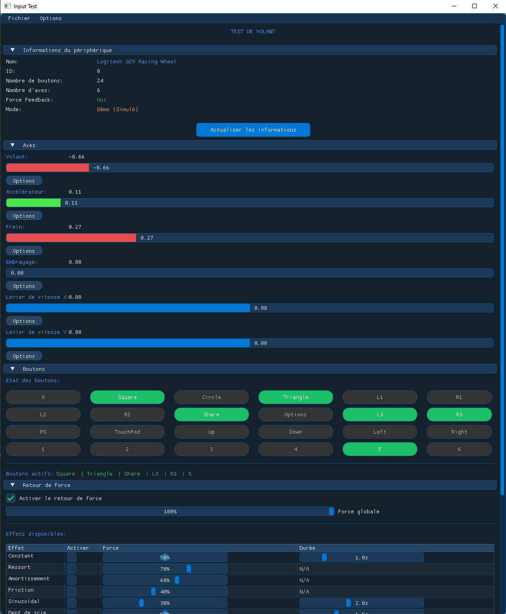

# Input Test App

## Overview
Input Test App is a comprehensive testing application for racing wheels and other gaming input devices. It provides detailed input visualization, force feedback testing, and device calibration capabilities in a user-friendly interface.

**Note: This project is currently a Work In Progress (WIP)**
## Screenshots


## Features

### Input Visualization
- Real-time monitoring of all wheel axes (steering, throttle, brake, clutch, and shifter)
- Visual representation of all controller buttons with active state indication
- Customizable input sensitivity and deadzone settings

### Force Feedback Testing
- Support for multiple force feedback effect types:
  - Constant force
  - Spring effect
  - Damper effect
  - Friction
  - Sinusoidal
  - Sawtooth
  - Rumble
  - Collision simulation
- Adjustable force intensity and duration
- Global strength control for all effects

### Testing Modes
- **Manual Mode**: Test wheel inputs directly with visual feedback
- **Automatic Mode**: Run predefined test patterns on axes and buttons
- **Recording Mode**: Record input sequences for later playback and analysis

### Device Management
- Automatic detection of racing wheels and similar input devices
- Support for calibrating individual axes
- Detailed device information display

### Additional Tools
- Logging system with configurable verbosity
- Configuration saving/loading
- Performance monitoring
- Cross-platform compatibility (Windows, Linux, macOS, PlayStation 5)

## Technical Details
- Built with SDL2 for cross-platform input handling
- ImGui-based user interface
- Force feedback powered by SDL Haptic API
- Modular architecture for easy extension

## Requirements
- SDL2 and SDL2_renderer libraries
- C++11 compatible compiler
- CMake 3.10+ for building

## Building
```bash
mkdir build
cd build
cmake ..
make
```

## Usage
Launch the application and it will automatically detect connected racing wheels. If no compatible device is found, it will run in demo mode.

The main interface is divided into collapsible sections:
1. **Device Information**: Details about the connected device
2. **Axes**: Visualization and calibration for each axis
3. **Buttons**: Interactive display of all controller buttons
4. **Force Feedback**: Testing interface for haptic effects
5. **Test Settings**: Configure and run test modes
6. **Statistics**: Performance data and logging options

## Future Enhancements
- Controller profile support for saving/loading device-specific settings
- Advanced FFB testing with custom pattern creation
- Expanded support for specialized racing peripherals (pedal sets, shifters, handbrakes)
- Integration with racing simulations for in-game testing

## License
This project is licensed under the MIT License - see the LICENSE file for details.

## Acknowledgements
- The ImGui team for the excellent immediate-mode GUI library
- SDL developers for the comprehensive input and haptic feedback APIs
- The racing simulation community for inspiration and testing
